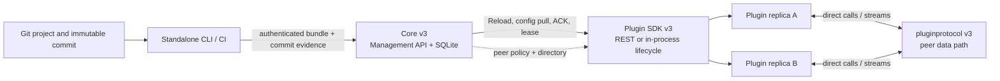

# Целевая архитектура экосистемы v3

Эта страница — единый межрепозиторный контракт для production-ready v3.
Она фиксирует границы Core, Plugin SDK и `pluginprotocol`, а также правила
совместимости. Реализация, owner TODO и runtime gates не считаются выполненными
только потому, что этот документ опубликован.

## Решение v3

v3 — breaking release train для трёх репозиториев. Старые публичные surfaces,
fallback и compatibility shims не поддерживаются после перевода всех
потребителей на новый контракт.

| Область | Канонический контракт v3 | Владелец |
| --- | --- | --- |
| Core control plane | desired state, SQLite, Management API, operations, audit, registrations, leases, rollout, peer-link policy | `core` |
| Core↔plugin lifecycle | REST + mTLS для отдельных процессов; in-process adapter для статически скомпонованных доверенных Go plugins | `plugin-sdk` совместно с `core` |
| Plugin↔plugin data path | generic calls, listeners и bidirectional streams; transport/security carriers | `pluginprotocol` |
| Generic peer wire | `liapoldus.peer.v1` | `pluginprotocol` |
| Studio/deploy | Git/project source, plan/apply, deploy и process lifecycle | standalone CLI/Studio; не Core |

Рекомендуемые Go module major paths для breaking release:

- `github.com/Liapoldus/core/v3` для публичного host API и нового runtime facade;
- `github.com/Liapoldus/plugin-sdk/v2` для нового lifecycle facade;
- `github.com/Liapoldus/pluginprotocol/v3` для новой Go public API.

Wire namespace не меняется автоматически вместе с Go module major. `liapoldus.peer.v1`
остаётся стабильным, пока не изменяется wire framing или message semantics.
Foreign bindings не входят в v3 release train; wire совместимость
обеспечивается официальным Go API и runtime conformance.

## Границы ответственности



Core never proxies peer payloads and never launches, installs, stops or updates
plugin processes. CLI/CI/operator owns those actions. Core stores the desired
configuration, observations and policy needed to admit safe rollout.

Plugin SDK owns the generic Core↔plugin lifecycle: identity, registration,
lease, readiness, exact-generation config pull, Reload/ACK, peer-directory
resolution, secret references, metrics and redacted lifecycle errors. It never
executes a peer call and never imports `pluginprotocol`.

`pluginprotocol` owns the generic peer session, framing, carriers, peer identity,
TLS/mTLS, revocation, cancellation, stream backpressure and close semantics. It
does not know Core, plugins, settings, manifests, rollout or product methods.

## Configuration and rollout model

Core is the only durable writer of its SQLite database. A project commit is
resolved and validated outside Core; the CLI sends an authenticated canonical
bundle with commit SHA, bundle digest, schema version, expected revision and
idempotency key. Core validates the envelope and plugin-owned schemas, stores
the exact JSON bytes, and records the chain:

```text
commit -> bundle digest -> durable operation -> config generation -> replica ACKs
```

Core does not interpret product fields. A candidate is promoted transactionally
to `active`, the prior value becomes `previous`, and an internal `staging`
record is never pullable by a plugin. Rollback is a new Core operation against
`previous`; it is not a plugin endpoint.

The rollout invariant is roll-forward: after promotion, `active` remains the
desired state even when a replica is degraded. Only replicas with the required
generation are eligible for traffic or peer-directory publication. Unknown
network results are not replayed automatically; a new mutation or explicit
operator action is required.

## Peer-link policy

Core owns the generic policy `caller instance -> target instance -> placement,
carrier, weight and required contract ranges`. Policy changes are authenticated
Management API mutations with CAS/ETag and audit records in SQLite. Core
publishes a caller-scoped, versioned peer-directory through Plugin SDK
long-poll. The directory contains eligible replica identity, endpoint,
generation, carrier and expiry; it never contains application payload.

The SDK resolver is fail-closed and chooses only the named link and declared
carrier. It does not retry through another link or transport. The plugin passes
the resolved authorization context to `pluginprotocol`'s generic authorizer;
the peer connection remains direct and Core is not on the data path.

This is one contract, not two modes: Core policy and SDK directory are required
in both REST and in-process Core compositions. In-process composition may use an
in-memory directory source, but it must preserve the same generation, identity,
expiry and deny-by-default semantics.

## Runtime profiles

Every profile is selected explicitly. No automatic carrier selection, downgrade
or secure-to-plaintext fallback exists.

| Scope | Supported carriers | Security |
| --- | --- | --- |
| Remote production | TCP, QUIC | mTLS, peer identity and fail-closed revocation |
| Linux/macOS local production | Unix socket; TCP/QUIC when explicitly configured | mTLS; filesystem permissions are additional controls |
| Windows local production | named pipe; TCP/QUIC when explicitly configured | mTLS; pipe ACL is an additional control |
| Development only | TCP loopback plaintext | explicit opt-in, never a production gate |

The Core↔plugin REST control plane always uses mTLS in production. Its separate
loopback health profile is opt-in and exposes only the generic health endpoint;
config pull, Reload, registration, leases and secret redemption remain mTLS-only.

## In-process composition

v3 supports a public Core Go host API and a Plugin SDK in-process lifecycle
adapter for compile-time selected trusted Go plugins. The adapter reuses the
same lifecycle models and semantics as REST:

1. Core creates an instance-scoped immutable configuration source;
2. Core dispatches Reload metadata without raw settings bytes;
3. the plugin pulls the exact generation through the scoped source;
4. the plugin validates and atomically applies exact bytes and digest;
5. the plugin returns the same ACK/error classification used by REST.

For a pure in-process host, `host.Options.DisableREST` is set explicitly; that
composition does not open a Core↔plugin REST listener. It does not claim process
isolation, mTLS or panic isolation. It is not a dynamic loader and does not
permit independent plugin upgrades. A binary containing child processes is
still a REST composition. Mode selection is explicit and a failed in-process
registration never falls back to REST.

`pluginprotocol` remains the only peer communication path even inside a
monolithic host. Direct product-plugin Go calls and shared mutable state are not
part of the contract.

## Production-ready v3 gate

The release is production-ready only when every applicable gate has reproducible
evidence in a clean checkout and the owner TODOs contain the exact command and
environment:

- Core, SDK and protocol unit, race, vet, static analysis and architecture gates;
- generated contract parity and schema/OpenAPI publication checks;
- REST and in-process SDK lifecycle conformance with identical generation,
  digest, ACK, lease, readiness, revoke and failure semantics;
- Core host API create/readiness/close smoke with one SQLite instance;
- direct peer call and bidirectional stream conformance for every claimed
  carrier/profile, including native Windows/macOS/Linux checks;
- cross-repository Core + SDK + protocol child-process E2E, restart/reconnect,
  CRL rotation, policy update/removal, rollout degradation and recovery;
- signed release artifact, SBOM and provenance evidence produced by the release
  pipeline; Core stores only immutable references/digests and does not become a
  package manager;
- documentation build and link checks with no contradictory v2/v3 ownership
  statements.

Until all applicable gates pass, the release is `v3-incomplete`, never
`production-ready`.

The release workflow is part of that gate: every Core contract bundle release
must carry a checksum, SPDX SBOM, keyless Sigstore bundle and GitHub
build-provenance attestation. CLI/CI may consume only a verified release
artifact; a mutable branch, unsigned archive or unverified local build is not a
production input.
